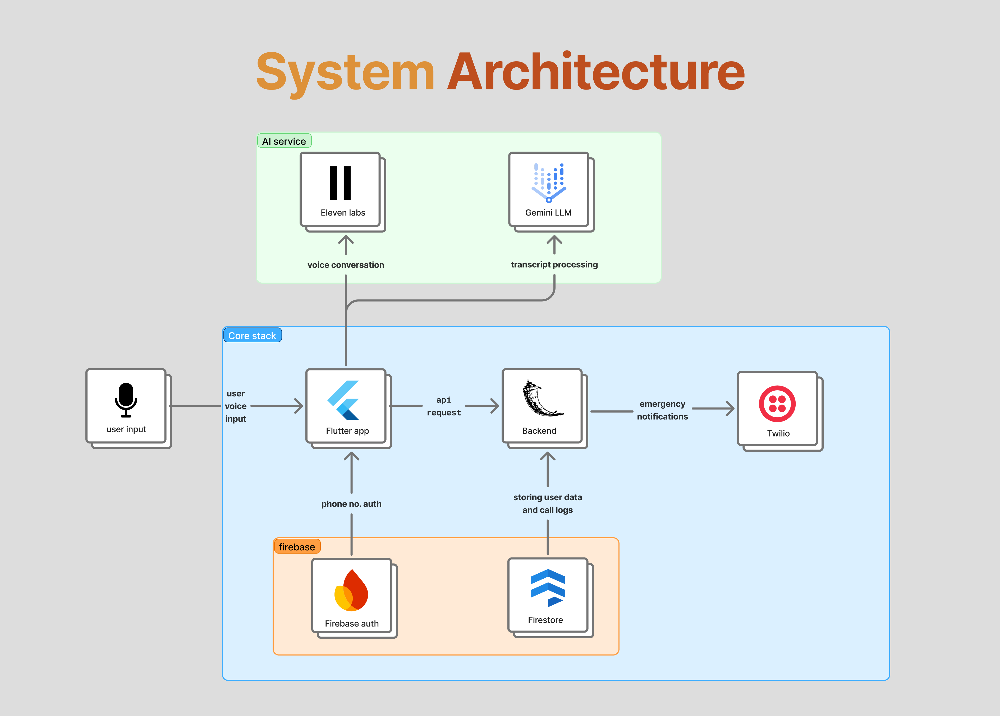
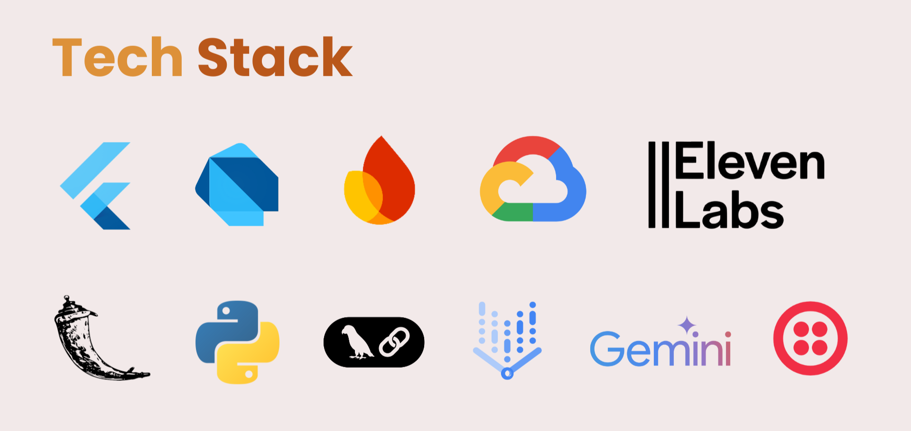

<p align="center">
	
</p>

<p align="center">
	
</p>

<p align="left">
  VoiceCare is an AI-powered platform for independent living, offering smooth voice-first onboarding, multilingual support, and friendly conversation. It provides personalized reminders, health monitoring, and instant emergency detection with calm guidance. Caregivers and family receive real-time updates, while multi-agent intelligence adapts to each user. 
</p>
<p align="left">
  It <b> supports multiple languages</b>, and adapts intelligently to each user.
</p>


<p align="center">
  
</p>

<samp>
  <h3>
    <a>
      Read our Blog Post -
      
      <a href="https://medium.com/@maitridalvi2004/empathetic-ai-companion-for-independent-living-95a1d1982a25">
        Medium
      </a>
    </a>
  </h3>
</samp>


---


## ✨ Features

| Feature                             | Description                                                    |
| ----------------------------------- | -------------------------------------------------------------- |
| *Smooth Voice-First Onboarding*   | Hands-free, guided setup through simple voice interactions.    |
| *Multilingual Support*            | Supports multiple languages for inclusive and accessible use.  |
| *Casual Conversation*             | Friendly conversations to reduce loneliness and build trust.   |
| *Personalized Reminders*          | Voice reminders for medication, appointments, and daily tasks. |
| *Health Monitoring*               | Monitors well-being and surfaces useful health insights.       |
| *Voice-First Emergency Detection* | Detects distress and emergencies using voice cues.             |
| *Calm Guidance & Support*         | Provides clear, calming step-by-step emergency guidance.       |
| *Automatic Alerts*                | Notifies caregivers or emergency services instantly.           |
| *Caregiver & Family Integration*  | Shares real-time updates with trusted contacts.                |
| *Multi-Agent Intelligence*        | Adapts responses using personalized AI agents.                 |

---


<p align="center">
	
</p>

<p align="center">

---

<p align="center">
	
</p>

<p align="center">

---

<h2 align="left">🌱 UN Sustainable Development Goals (SDGs)</h2>

<p align="left">
  <b>VoiceCare aligns with the following UN Sustainable Development Goals:</b>
</p>

<br>

<details>
  <summary style="display: flex; align-items: center; gap: 10px;">
    
    <b>SDG 3 – Good Health & Well-Being</b>
  </summary>

  <br>

  <ul>
    <li>Early emergency detection through voice distress cues</li>
    <li>Calm, guided assistance during critical situations</li>
    <li>Continuous well-being and safety monitoring</li>
    <li>Emotional reassurance via friendly AI companionship</li>
  </ul>
</details>

<br>

<details>
  <summary style="display: flex; align-items: center; gap: 10px;">
    
    <b>SDG 10 – Reduced Inequalities</b>
  </summary>

  <br>

  <ul>
    <li>Voice-first, screen-free interaction for accessibility</li>
    <li>Multilingual support for diverse user groups</li>
    <li>Designed for elderly and digitally underserved populations</li>
  </ul>
</details>


---

## Setup Instructions

### 1. Clone the repository
```bash
git clone https://github.com/shwet46/VoiceCare.git
cd VoiceCare
```

### 2. Set up the Backend
Navigate to the `backend` directory and install the Python dependencies.
```bash
cd backend
uv sync
```
*Note: Make sure you have Python 3.9+ installed.*

### 3. Set up the Mobile App
Navigate to the `mobile` directory and get the Flutter dependencies.
```bash
cd ../mobile
flutter pub get
```
*Note: Make sure you have Flutter SDK installed.*

---

## 👥 Team members

<table align="center">
  <tr>
    <td align="center" style="padding: 20px;">
      <br><br>
      <b>Ojasvi</b><br>
      <a href="https://github.com/ojasvi004">@ojasvi004</a>
    </td>
    <td align="center" style="padding: 20px;">
      <br><br>
      <b>Maitri</b><br>
      <a href="https://github.com/maitri707">@maitri707</a>
    </td>
    <td align="center" style="padding: 20px;">
      <br><br>
      <b>Shweta</b><br>
      <a href="https://github.com/shwet46">@shwet46</a>
    </td>
    <td align="center" style="padding: 20px;">
      <br><br>
      <b>Samarth</b><br>
      <a href="https://github.com/sambhandavale">@sambhandavale</a>
    </td>
  </tr>
</table>

---

## 📜 License

This project is licensed under the Apache License 2.0. See the [LICENSE](LICENSE) file for details.

---

**Note:** This app is currently in its MVP (Minimum Viable Product) stage.

